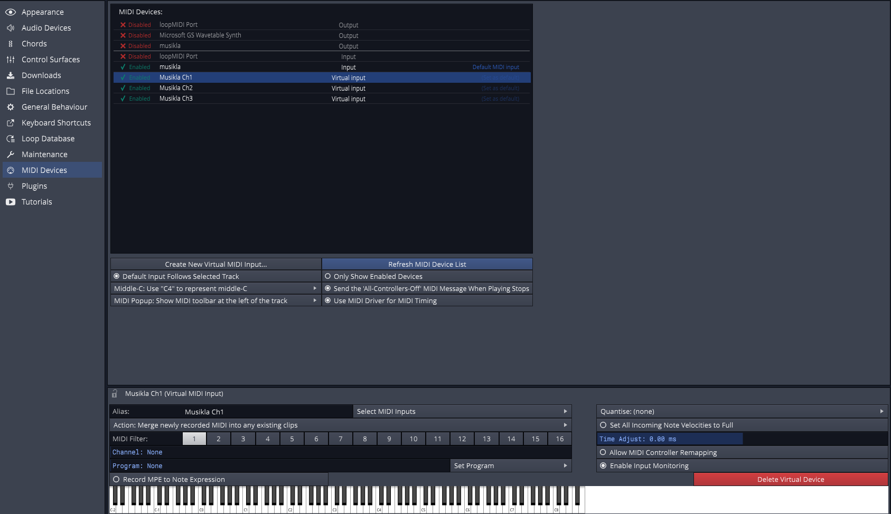
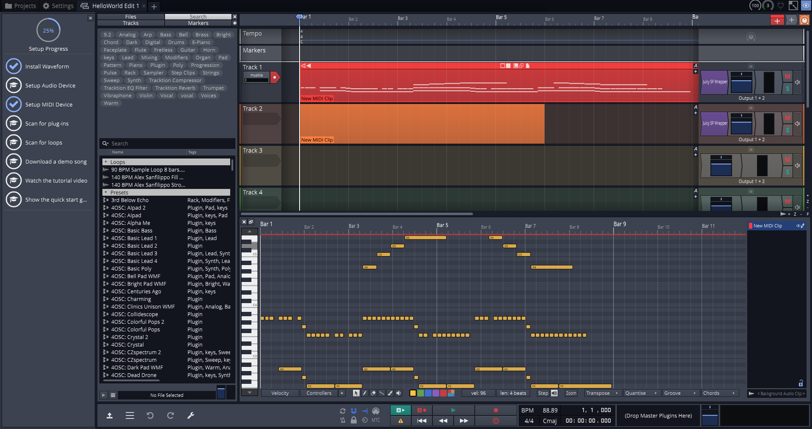

# Recording to Traktion Waveform
The default way of playing sounds in Musikla is through the embedded fluidsynth library and a soundfont file. However, other ways of playing the audio are supported.

One of those ways is emitting MIDI data to an open port that can then be played by any supporting device or application.

In this tutorial, we'll explore how to connect the musikla MIDI events to the [Traktion Waveform FREE](https://www.tracktion.com/products/waveform-free) software.

## Prerequisites
Other than having both musikla and Traktion WaveForm installed, the user may need some additional software installed.

 - [loopMIDI](https://www.tobias-erichsen.de/software/loopmidi.html) Musikla does not suport virtual MIDI ports out of the box for some platforms (like Windows). This application can be used to easily create multiple virtual ports.
 - [Juicy SF](https://github.com/Birch-san/juicysfplugin) A good easy-to-use SoundFont VST plugin that supports both 32bit and 64bit.
 - [GeneralUser GS](http://www.schristiancollins.com/generaluser.php) A good and free soundfont to use

## Step 1: The Code
Any valid musikla file should work, but if you want to try this out and don't have any, you can just use this small sample.

    #!musikla
    :piano = I1 S6/8 T140 L/8 V120;
    :violin = :piano(I41);
    
    $chorus = :piano (A*11 G F*12 | A,6 A,5 G, F,6*2)*3;

    $melody = :piano (r24   (:violin a3 c'3 d'3 e'9) r9 e'3 d'3 c'3 a9);

    play( $chorus | $melody );

## Step 2: Configuring WaveForm MIDI
After you've created at least one virtual MIDI port in loopMIDI, you can also create additional virtual ports inside WaveForm and filter what channels each port gets.

## Step 3: Configuring WaveForm Tracks

## Step 4: Running Musikla

